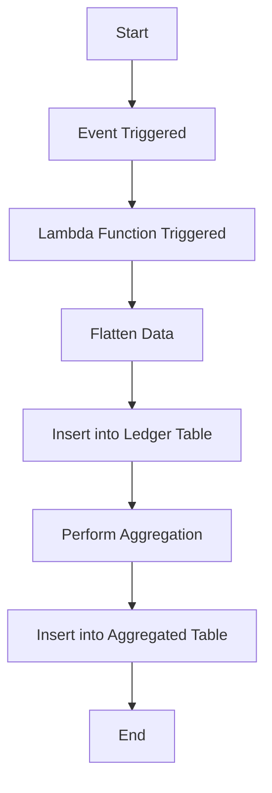

### Detailed Explanation of the Workflow

1. **Start**
   - **Event**: The workflow begins with a trigger event.
   - **Explanation**: This may be a user action, scheduled job, or any system event that generates an entry in the DynamoDB table.

2. **Event Triggered**
   - **Event**: New data entry is added to DynamoDB.
   - **Explanation**: AWS DynamoDB detects the new entry and triggers an AWS Lambda function to process this data.

3. **Lambda Function Triggered**
   - **Function**: A Lambda function is automatically invoked.
   - **Explanation**: The Lambda function retrieves the new entry for further processing.

4. **Flatten Data**
   - **Process**: Data flattening and normalization.
   - **Explanation**: The Lambda function processes the DynamoDB entry. It extracts necessary fields, normalizes the structure, and flattens the data.

5. **Insert into Ledger Table**
   - **Process**: Data insertion into PostgreSQL.
   - **Explanation**: The processed data is inserted into a ledger table in a PostgreSQL database. This table categorizes data based on types and sources.

6. **Perform Aggregation**
   - **Process**: Aggregation based on user_id.
   - **Explanation**: After insertion, an aggregation process occurs to calculate sums, averages, or other necessary metrics by user_id.

7. **Insert into Aggregated Table**
   - **Process**: Insert aggregated data.
   - **Explanation**: The aggregated results are inserted into a secondary table in the PostgreSQL database, organized by user_id.

8. **End**
   - **Event**: The workflow process completes.
   - **Explanation**: After all data is processed and inserted, the workflow completes successfully.

---

### Flowchart in Markdown with Mermaid Syntax

